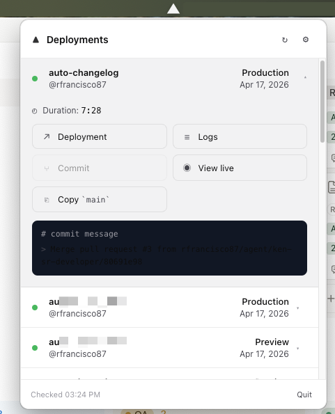

# Deployer

A native macOS menu bar app that surfaces Vercel deployment status in real time. Built with Electron.



## Features

- **Menu bar dot** — white triangle with a colored circle: green = ready, yellow = building, red = failed.
- **Live build timer** — while a build is in flight, the menu bar shows the elapsed time (e.g. `02:34`).
- **Drop-in notification card** — a small card slides down from the menu bar on every finished deploy with the project name, outcome, and duration. Click it to see the full details. Auto-hides after ~35 s so it doesn't take over your workflow.
- **Deployments popup** — click the tray icon to see recent deployments across every watched project; expand a row to see the commit, branch, build duration, and quick-open buttons for the deployment, logs, commit, and the live URL.
- **Native notifications** — macOS notification on every terminal state transition.
- **Secure token storage** — your Vercel token lives in the macOS Keychain, never in plain text on disk.
- **Sleep-aware** — polling pauses when your Mac sleeps and resumes silently on wake (no notification storm).

## Requirements

- macOS 13 Ventura or later
- A Vercel account — **Hobby plan works**; any personal access token is enough
- For building from source: Node 20+ and Xcode Command Line Tools

## Install (end users)

The app is distributed unsigned — macOS Gatekeeper will block first launch. The three steps below get you running in under a minute.

1. **Grab the latest build** from the [Releases page](https://github.com/rfrancisco87/deployer/releases) (or the `release/` folder if you built it yourself):
   - `Deployer-<version>-arm64-mac.zip` for Apple Silicon
   - `Deployer-<version>-mac.zip` for Intel
2. **Unzip and move to `/Applications`:**
   ```bash
   unzip ~/Downloads/Deployer-*-arm64-mac.zip -d /Applications
   ```
3. **Bypass Gatekeeper** (only required once, because the app isn't code-signed):
   ```bash
   xattr -dr com.apple.quarantine /Applications/Deployer.app
   open /Applications/Deployer.app
   ```

   Alternatively: right-click `Deployer.app` in Finder → **Open** → confirm the "unidentified developer" prompt.

After the first launch, Deployer runs like any normal macOS app — no terminal required.

## First-time setup

1. Click the Deployer icon in the menu bar → **Settings…**
2. Paste a Vercel personal access token. Create one at
   [vercel.com/account/tokens](https://vercel.com/account/tokens) — Hobby accounts have full API access.
3. Pick the projects you want to watch (or click **Select all**).
4. (Optional) Turn on **Launch Deployer at login** so it starts with your Mac.

That's it. The tray dot updates on every poll (default: every 45 seconds; tunable in Settings).

## Using the app

### Menu bar icon

| State       | Appearance                         |
|-------------|------------------------------------|
| Idle / no data | White triangle                   |
| Latest deploy READY | White triangle + green circle |
| Latest deploy BUILDING | White triangle + yellow circle + elapsed timer |
| Latest deploy ERROR | White triangle + red circle |
| Token missing/invalid | Triangle + red circle + `⚠` tooltip |

Once you've seen a deployment's details (via the notification card or by expanding it in the popup), the colored dot drops back to the plain triangle until the next transition.

### Interactions

- **Left-click the icon** — toggle the full deployments popup.
- **Right-click the icon** — small menu with "Show Deployments", "Settings…", "Quit".
- **Notification card** (appears on each new terminal deploy) — click it to jump straight into the focused detail view for that deployment.

## Build from source

```bash
git clone https://github.com/rfrancisco87/deployer.git
cd deployer
npm install
npm start              # builds + launches with Electron
```

Hot-rebuild loop:

```bash
npm run build          # one-shot TS + asset copy
npm run dev            # alias of `start`
```

### Packaging your own `.app`

```bash
npm run package        # produces release/mac-arm64/Deployer.app + zips
```

`electron-builder` rebuilds native modules for the target architecture automatically. Output lands in `release/` — follow the "Install" section above using the zip you produced.

### Regenerating tray icons

The tray PNGs are generated from code (no binary assets in `src/`) so tweaks are version-controlled. After changing [scripts/generate-tray-icons.js](scripts/generate-tray-icons.js):

```bash
node scripts/generate-tray-icons.js
npm run build
```

## Known caveats

- **Arc browser** — Arc has quirks with `open <url>`: external URL opens sometimes go to "Little Arc" or only activate the window without navigating. Deployer detects Arc as the default browser and uses Arc's AppleScript interface instead, which opens a new tab in Arc's front window.
- **Unsigned binary** — the app isn't code-signed (no paid Apple Developer account), hence the one-time Gatekeeper bypass. The source is public if you'd rather build it yourself.
- **Keychain prompts on first use** — macOS may prompt once to allow Deployer to access your keychain entry for the Vercel token.

## Open source

Free and open. Contributions welcome — fork, branch, PR. Keep changes small and focused; this is a personal tool first and a product second.

## License

MIT — Copyright © 2026 Roberto Francisco
